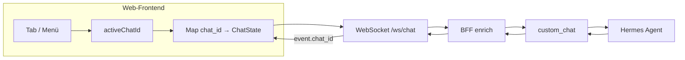

# Multi-Chat / Sessions — Web-UI Plan

Plan for multiple parallel conversations in the `custom_chat` web app, switchable via tabs or a session menu.

**Status:** draft — not implemented  
**Depends on:** [Event Schema v1](universal-platform-adapter-v1.md), [path-discovery](path-discovery.md)  
**Related:** [web-app.md](../web-app.md), [custom_chat.md](../custom_chat.md)

---

## Ziel

Nutzer können im Browser mehrere Chats parallel führen und zwischen ihnen wechseln (Tabs oder Seitenmenü). Jeder Chat hat eigenen Transcript-State und eine eigene Hermes-Konversation. Eine WebSocket-Verbindung zum BFF reicht aus.

## Ist-Zustand

| Ebene | Verhalten heute |
|-------|-----------------|
| Event Schema v1 | `chat_id` trennt Konversationen; `thread_id` optional für Threads; `session_id` nur Client-Metadaten |
| Plugin `custom_chat` | Routet Inbound/Outbound per `chat_id`; kein Session-Registry-API |
| BFF `enrich_inbound` | Setzt `chat_id`/`user_id` nur wenn fehlend — clientseitige IDs bleiben erhalten |
| Web-UI | Ein fester `CHAT_ID` (`workspace:demo`), ein `chatReducer`, kein Filter auf eingehende `chat_id` |

`StreamSession` im Plugin bezeichnet **Streaming pro Antwort-`message_id`**, nicht einen Benutzer-Chat.

## Architekturentscheidung

**Konversationstrennung über `chat_id`**, nicht über `session_id`.

| Feld | Verwendung im Web-UI |
|------|----------------------|
| `chat_id` | Pro Tab/Chat eine stabile ID, z. B. `workspace:<uuid>` |
| `user_id` | Weiterhin aus Env/BFF-Default oder explizit pro Client |
| `thread_id` | V1 out of scope (später für Threads innerhalb eines Chats) |
| `session_id` | Optional: Browser-Tab-Korrelation; ersetzt nicht `chat_id` |

**Annahme (vor Implementierung verifizieren):** Hermes Agent isoliert Kontext/History pro `chat_id` in `MessageEvent.source` (wie bei anderen Platform-Adaptern). Test: zwei `chat_id`s, Nachricht in A, Frage in B — B darf Inhalt aus A nicht kennen.

## Nicht im Scope (V1)

- Serverseitige Chat-Liste oder Persistenz
- Sync zwischen Geräten/Browsern
- Plugin-API zum Auflisten/Löschen von Chats
- Automatische Chat-Titel (nur Anzeige aus lokalem Label oder gekürzter `chat_id`)
- `thread_id`-UI

## Betroffene Pfade

| Bereich | Dateien (voraussichtlich) |
|---------|---------------------------|
| Plan | `docs/plans/multi-chat-sessions-web-ui.md` (dieses Dokument) |
| Frontend State | `web/frontend/src/features/chat/chatReducer.ts`, ggf. `sessionStore.ts` |
| Frontend UI | `web/frontend/src/features/chat/ChatPage.tsx`, neu: `ChatTabs.tsx` oder `SessionMenu.tsx` |
| Frontend API | `web/frontend/src/api/wsClient.ts` (unverändert oder kleine Hilfsfunktionen) |
| Frontend Persistenz | `web/frontend/src/features/chat/sessionPersistence.ts` (neu, `localStorage`) |
| Tests | `web/frontend/src/features/chat/*.test.ts` |
| BFF | Keine Pflichtänderung; optional Doku in `docs/web-app.md` |
| Plugin | Keine Pflichtänderung für Tabs |

---

## PR1 — Session-Modell & Persistenz (Frontend)

### Objective

Datenmodell und lokale Persistenz für mehrere Chats; noch keine sichtbare Tab-UI.

### Scope

- Typ `ChatSession`: `{ chatId, label, createdAt, lines, streamingMessageId, … }`
- Store: `activeChatId`, `sessions: Record<chatId, ChatSession>`
- `localStorage`-Schema (Versioniert): Liste der Sessions + aktiver Tab + pro Session Transcript (optional nur Metadaten + letzte N Zeilen)
- Neue Session: `chatId = workspace:${crypto.randomUUID()}`, Default-Label z. B. „Chat 1“
- Migration vom heutigen Single-Chat-State (ein Demo-Chat beim ersten Load)

### Tests

- Reducer: Session anlegen, wechseln, Events nur der richtigen Session zuordnen
- Persistenz: Roundtrip `localStorage` load/save

### DoD

- Mehrere Sessions im State, Wechsel per API/Hook testbar
- Keine Regression der bestehenden Send-Pfade (weiter ein `WsClient`)

---

## PR2 — Inbound-Routing & Send mit aktiver `chat_id`

### Objective

Eine WebSocket-Verbindung, korrekte Zuordnung aller Events und Sends zur Session.

### Scope

- `INBOUND_EVENT`: `event.chat_id` → Ziel-Session; unbekannte `chat_id` optional neue Session oder ignorieren (konfigurierbar, Default: neue Session)
- Send-Helfer: immer `activeChatId` an `WsClient.sendText` / `sendCommand` / …
- `message.cancel` nur für `streamingMessageId` der **aktiven** Session (oder pro Session tracken)
- Hintergrund-Tabs: eingehende Deltas in die passende Session schreiben, auch wenn nicht aktiv

### Tests

- Zwei Sessions, Events mit unterschiedlicher `chat_id` landen getrennt
- Parallele Streams in zwei Chats auf einer Verbindung

### DoD

- Manuell: zwei Chats abwechselnd bedienbar ohne Transcript-Vermischung

---

## PR3 — Tab-Leiste oder Session-Menü (UI)

### Objective

Sichtbarer Wechsel zwischen Chats.

### Scope

- Komponente `ChatTabs` (horizontal) **oder** `SessionMenu` (Dropdown/Sidebar) — eine Variante für V1
- Aktionen: Tab wählen, „Neuer Chat“, Tab schließen (mit Bestätigung wenn Transcript nicht leer)
- Terminal-Title zeigt `label` oder `@chat_id` der aktiven Session
- UI-Strings neutral (keine Debug-/Prompt-Texte)

### Tests

- Komponententest: Tab-Wechsel ruft `setActiveChatId` auf
- Snapshot oder ARIA-Labels für Barrierefreiheit (minimal)

### DoD

- Operator kann im Browser zwischen mindestens zwei Chats wechseln und getrennt schreiben

---

## PR4 — Doku & Hermes-Verifikation

### Objective

Betrieb und Integrationsannahmen dokumentieren.

### Scope

- `docs/web-app.md`: Multi-Chat-Verhalten, `chat_id`-Konvention, `localStorage`-Hinweis
- Kurzer Abschnitt in `docs/custom_chat.md`: mehrere `chat_id` pro WebSocket-Verbindung
- Checkliste manueller Hermes-Test (zwei `chat_id`, Kontexttrennung, `/reset` pro Chat)
- Optional: Beispiel in `docs/examples/custom-chat-events-v1.json` mit zweiter `chat_id`

### DoD

- Doku beschreibt Voraussetzungen und Grenzen
- Hermes-Verifikation in Checkliste abgehakt oder als offener Punkt markiert

---

## Offene Punkte

| Thema | Entscheidung nötig |
|-------|-------------------|
| Hermes Kontext pro `chat_id` | Manuell gegen laufende Instanz prüfen |
| Tab schließen | Transcript verwerfen vs. archivieren in `localStorage` |
| Max. Sessions | Limit (z. B. 20) gegen `localStorage`-Größe |
| Unbekannte inbound `chat_id` | Auto-Session vs. ignorieren |
| Label bearbeiten | V1 weglassen oder Inline-Rename |

## Risiken

| Risiko | Mitigation |
|--------|------------|
| Hermes mischt Kontexte | Vor PR2 verifizieren; ggf. Dokumentation/Workaround |
| `localStorage` voll | Session-Limit, Transcript-Kürzung |
| Parallele Streams | Tests in PR2; Adapter nutzt `reply_id` + `chat_id` |

## Akzeptanzkriterien (Gesamt)

1. Mindestens zwei Chats parallel, Wechsel ohne Reload.
2. Transcripts bleiben pro `chat_id` getrennt (inkl. Hintergrund-Deltas).
3. Slash-Commands und Cancel wirken auf die aktive Session.
4. Nach Reload: Sessions aus `localStorage` wiederhergestellt (soweit PR1 spezifiziert).
5. Keine Plugin-Änderung zwingend erforderlich für V1.

## Referenz: relevante Code-Stellen

- Feste Single-Chat-ID: `web/frontend/src/features/chat/ChatPage.tsx`
- Reducer ohne `chat_id`-Filter: `web/frontend/src/features/chat/chatReducer.ts`
- BFF enrich: `web/backend/app/ws/chat_proxy.py`
- Adapter-Routing: `plugins/platforms/custom_chat/adapter.py` (`_ws_by_chat`, `_emit_outbound`)
